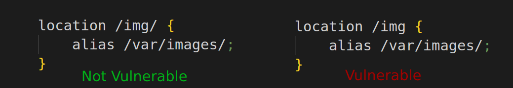
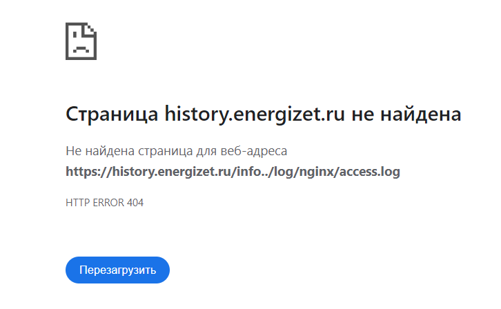
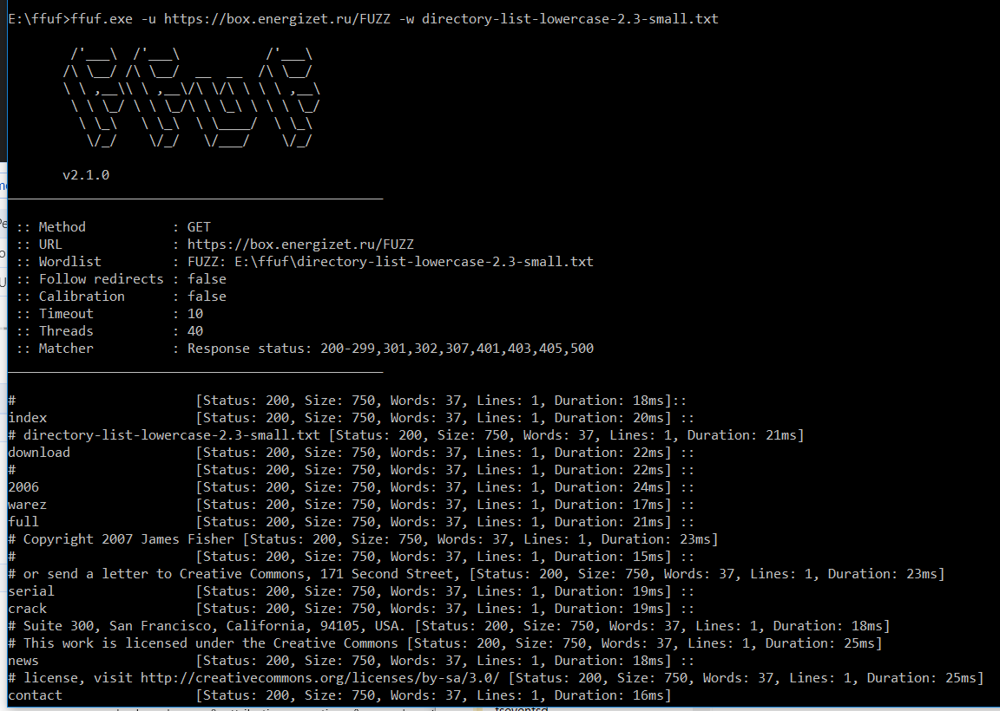
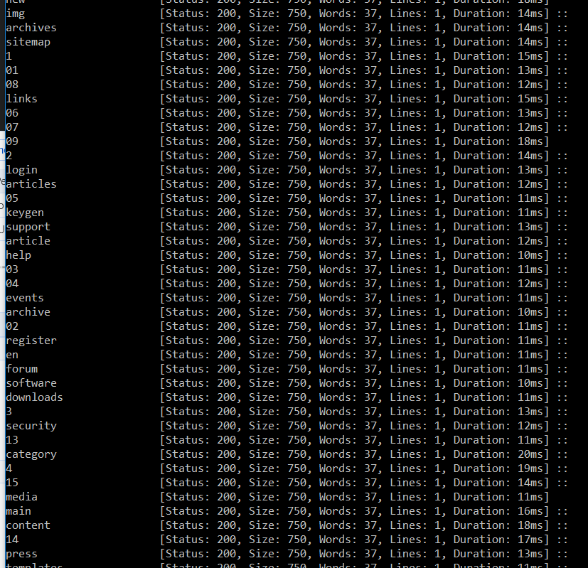
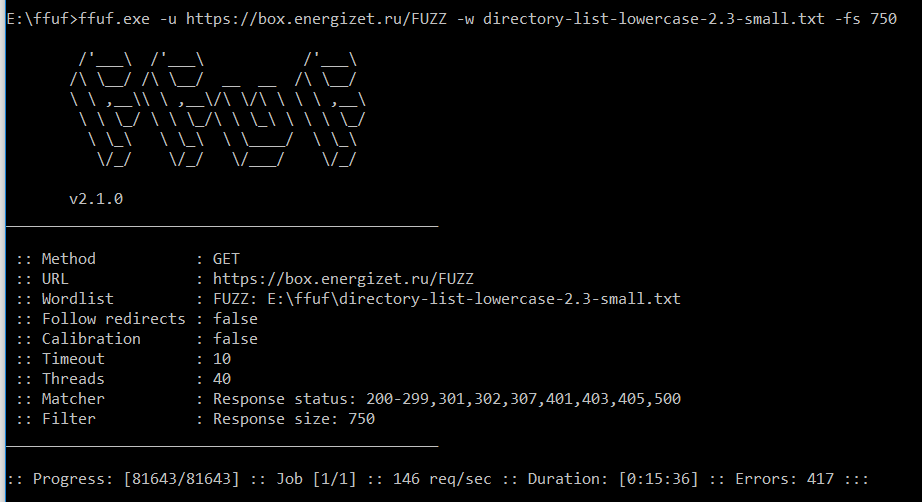
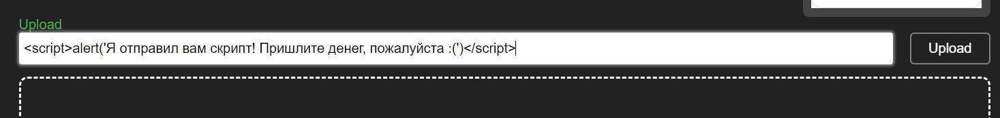

# Лабораторная работа №1* 

## Цель работы:
Попробовать взломать nginx одногруппника

## Задание:
Проверить минимум три уязвимости:
1)path traversal;
2)перебор страниц через ffuf;
3)любая другая уязвимость на выбор.

## Выполнение работы

### 1. Проверка уязвимости Path Traversal

#### 1.1 Об атаке.
Path Traversal — это тип уязвимости в веб-приложениях, которая позволяет злоумышленнику получить доступ к файлам и директориям на сервере, которые обычно не доступны через веб-интерфейс.
Злоумышленник может использовать специально сформированный URL-адрес, чтобы перейти за пределы корневой директории веб-приложения и получить доступ к файлам, которые находятся вне веб-приложения.

#### 1.2 Условия, при которых возможна атака.
Поскольку исследуемое веб-прилодение использует nginx, то условием возможности атаки является неправильная конфигурация nginx.

Чтобы атака сработала, нужны следующие условия:
- директива location не должна иметь завершающую косую черту.
- директива alias должна быть указана внутри location и должна заканчиваться косой чертой.


 
#### 1.2 Описание атаки.
В приведенном вына на картинке примере nginx будет сопоставлять любые URL-адреса, начинающиеся с `/img`, и возвращать все, что следует за этой косой чертой, с добавленным `alias` пути `/var/images/`.
Это означает, что и запрос `/img/profile.jpg`, и запрос `/imgprofile.jpg` вернут один и тот же файл.

Учитывая, что мы можем получить доступ к целевой папке через любой URL-адрес запроса, начинающийся с `/img`,
мы можем попытаться получить доступ к каталогу `..`, тем самым достигнув родительского каталога для целевого, отправив запрос к `/img..` для приведенного примера.

Если мы получаем ответ о редиректе от nginx, мы можем предположить, что nginx обнаружил каталог и пытается перенаправить нас в `/img../`, как это обычно происходит при доступе к каталогу.

Следовательно, любой файл или дочерний каталог в родительском каталоге целевой папки будут доступны для нас, и nginx с готовностью их вернет.
В нашем примере это означает, что мы можем получить доступ ко всем файлам в папке `/var/`, учитывая, что целевая папка в конфигурации — `/var/images/`.
Это позволяет нам использовать простые приемы, такие как `GET, /img../log/nginx/access.log` для загрузки логов, расположенных в `/var/log/nginx/access.log`.

информация любезно предоставлена [хабром](https://habr.com/ru/articles/745718/).

#### 1.3 Атакуем nginx одногрупника
Поскольку нам доступен конфиг одногрупника, то идём изучать его, открываем, не видим никаких `alias` и грустим. Атаковать бессмысленно, но мы всё же попробуем: 


Эх, ничего не вышло, а так хотелось :(

### 1. Перебор директорий через Fuff

#### 1.1 Об атаке.
Ffuf - программа для перебора содержимого веб-приложений. Позволяет обнаруживать скрытые директории и файлы. 

#### 1.2 Описание атаки.
Атака представляет собой банальный брутфорс URL-адресов веб-приложения с подстановкой в URL значений из словаря.

Комманда для запуска:

```
ffuf -w /path/to/wordlist -u https://target/FUZZ
``` 

- -w - путь к файлу со словарём, слова из которого будет подставляться вместо FUZZ в ссылке на иследуемое веб-прилодение.
- -u - это ссылка на исследуемое веб-проложение, в которую добаваили FUZZ. FUZZ будет заменяться словами из словаря.

#### 1.3 Атакуем nginx одногрупника
Словарь возмём тут: https://github.com/danielmiessler/SecLists

Запускаем fuff и сразу видим результат!




Но постойте, программа продолжаем обнарудивать каталоги, при этом ответ всегда 200 и размер их одинаков и равен 750!
Что-то тут не так.


Попробуем открыть любой каталог на сайте. 


Да тут же стоит заглушка!
Запустим программу снова, но теперь добавим фильтрацию по размеру контента с помощью параметра `-fs 750`. Таким образом отфильтруем все страницы, у которых размер контента = 750.



Увы, но никаких скрытых директорий обнаружить не удалось :(


### 1. Атака с помощью XSS

#### 1.1 Об атаке.
XSS (англ. Cross-Site Scripting) — благодаря этой атаке злоумышленнику удается внедрить на страницу JavaScript-код, который не был предусмотрен разработчиками. Этот код будет выполняться каждый раз, когда жертвы (обычные пользователи) будут заходить на страницу приложения, куда этот код был добавлен. 
В зависимости от задач злоумышленника, с помощью межсайтового скриптинга можно перехватывать управление сессией, перенаправлять пользователя на вредоносные сайты или просто следить за деятельностью пользователя.

#### 1.2 Описание атаки.
Внедрение вредного межсайтового скрипта происходит через интерактивные элементы. Пример: размещение в поисковой строке, в области обратной связи, месте для сообщений или комментариев.

#### 1.3 Атакуем nginx одногрупника
Вставляем в поле ввода `<script>alert('Я отправил вам скрипт! Пришлите денег, пожалуйста :(')</script>`
Если сайт уязвим, то мы увидим на страничке сообщение с всплывающим окном.


Нажимаем кнопку `Upload`. Ожидаемого сообщения мы не видим, но сценарий определённо ломается, т.к. получаем бесконечную загрузку. Возможно, тут можно использовать какой-то другой вид уязвимостей.



### 1. Выводы

В результате выполения работы мы узнали о некоторых видах уязвимостей веб-приложений.


