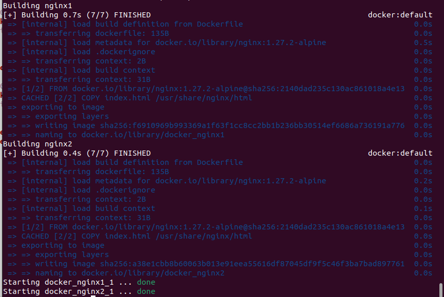
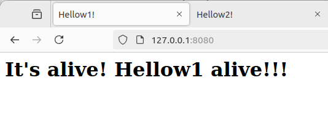

# Лабораторная работа №2* - Знакомство с Docker-compose.

## Цель работы

- Познакомиться с плохими и хорошими практиками написания Dockerfile-compose файлов.
- Узнать, как изолировать контейнеры друг от друга. 

## Выполение работы

### Пример плохого Dockerfile-compose файл.

Всё тот же студентус добрался до docker-compose и написал свой первый конфиг.

```
version: '3.8'

services:
  nginx1:
    image: nginx
    ports:
      - "8080:80"
    volumes:
      - ./html:/usr/share/nginx/html

  nginx2:
    image: nginx
    ports:
      - "8081:80"
    volumes:
      - ./html:/usr/share/nginx/html
```

### Разбор плохого конфига
Дайте посмотрим на него внимательно и разберёмся, что же тут не так и как можно это всё исправить.

1. **Использован тэг *latest***.
Если в образе не указан тэг, по используется тэг по умолчанию, а именно **latest**.
Использование данного тэга приводит к непредсказуемым последствиям, т.к. при каждом добавлении в репозиторий новой версии образа ваш контейнер будет собираться на этом новом образе.
А ведь может и вовсе не собраться.
А может собраться, но ваше приложение вдруг начнёт вести себя не так, как ожидалось.  
При  в ваш репозиторий добавлили новую версию образа с другим списком ПО и обновлениями.
Чтобы не разгребать возможные последствия, лучше использвать фиксированную версию образа: `image: nginx:1.27.2-alpine`
 
2. **Не заданы ресурсные огранения**.
Без ограничений на ресурсы какой-нибудь контейнер может занять их полностью, что вызовет проблемы у других сервисов. 
Плюсом ограничей так же будет понимание, сколько ресурсов потребляет тот или иной сервис, а значит можно прикинуть, какая инфраструктура для них нужна.

3. **Использование локальных томов (`./html`)**.
Указание монтирования `./html` напрямую может вызвать проблемы при переносе на другую среду, так как структура файлов может отличаться.
Лучше использовать именованные тома, чтобы избежать проблем с совместимостью.

4. **Использование дефолтной сети**.
Контейнеры используют стандартную сетевую конфигурацию Docker без явной настройки. Это может привести к конфликтам, особенно если другие контейнеры используют те же порты.
Для исправления следует выделить сервисы в отдельную сеть.


### Корректный конфиг

В итоге получили исправленный compose dockerfile:

```
version: '3.8'

services:
  nginx1:
    image: nginx:1.27.2-alpine
    ports:
      - "8080:80"
    volumes:
      - nginx1-data:/usr/share/nginx/html
    deploy:
      resources:
        limits:
          cpus: '0.5'
          memory: 512M
    networks:
      - nginx-network

  nginx2:
    image: nginx:1.27.2-alpine
    ports:
      - "8081:80"
    volumes:
      - nginx2-data:/usr/share/nginx/html
    deploy:
      resources:
        limits:
          cpus: '0.5'
          memory: 512M
    networks:
      - nginx-network

networks:
  nginx-network:

volumes:
  nginx1-data:
  nginx2-data:
```

Мы молодцы, мы красавчики.

### Изолируем контейнеры друг от друга:

Для изоляции контейнеров в рамках одного Docker Compose проекта можно создать пользовательскую сеть для каждого сервиса.
Это позволит контейнерам "не видеть" друг друга по сети.

Для этого:
1. Создаём две пользовательские сети *nginx1-network* и *nginx2-network*
2. Каждому серсису прописываем свою сеть.

Вот так выглядит конфиг с изолированны друг от друга сетями:

```
version: '3.8'

services:
  nginx1:
    image: nginx:1.27.2-alpine
    ports:
      - "8080:80"
    volumes:
      - nginx1-data:/usr/share/nginx/html
    deploy:
      resources:
        limits:
          cpus: '0.5'
          memory: 512M
    networks:
      - nginx1-network

  nginx2:
    image: nginx:1.27.2-alpine
    ports:
      - "8081:80"
    volumes:
      - nginx2-data:/usr/share/nginx/html
    deploy:
      resources:
        limits:
          cpus: '0.5'
          memory: 512M
    networks:
      - nginx2-network

networks:
  nginx1-network:
  nginx2-network:

volumes:
  nginx1-data:
  nginx2-data:
```

### Немного практики
Ставим докер-композ командой `sudo apt install docker-compose`
Создаём папку для проекта, туда кладём .yaml файл и создаём две папки для контейнеров, где будут лежать для необходимые файлы.
Схематично выглядит так:

```
docker/
├── compose.yaml
├── nginx1/
│   ├── index.html
│   └── Dockerfile
└── nginx2/
    ├── index.html
    └── Dockerfile
```

compose.yaml:
```
version: '3.8'
services:
  nginx1:
    build:
      context: ./nginx1
    ports:
      - "8080:80"
    networks:
      - nginx1-network

  nginx2:
    build:
      context: ./nginx1
    ports:
      - "8081:80"
    networks:
      - nginx2-network

networks:
  nginx1-network:
  nginx2-network:
```

Переходим в директорию docker, выполняем команду `docker-compose up -d`:



Проверяем работу контейнеров:




Всё отлично, всё работает. Остановить контейнеры можно командой `docker-compose down`.

## В заключение

Мы научились писать docker-compose конфиг, узнали о типичных ошибках, к чем они приводят, а так же как их обойти.
Дополнительно научились изолировать сервисы друг от друга. 
