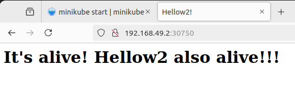

# Лабораторная работа №3 - Знакомство с K8s.

## Цель работы

- поднять локальный kubernetes кластер;
- развернуть в нём свой сервис. 

## Выполение работы

### Установка Minikube.
Для этого выполняем следующие команды: 
```
curl -LO https://storage.googleapis.com/minikube/releases/latest/minikube-linux-amd64
sudo install minikube-linux-amd64 /usr/local/bin/minikube && rm minikube-linux-amd64
```


Проверяем, всё ли прошло успешно, выполнив команду `minikube start`


Как видно на скрине, успехом тут и не пахнет.
Вчитываемся в логи, видим там предложенное решение, создаём группу docker и добавляем в неё нашего юзера:
```
sudo usermod -aG docker $USER && newgrp docker
```

Снова стартуем миникуб, и ура, проблема ушла, всё завелось!


Теперь нужно установить kubectl — консольну утилиту для работы с объектами кластера kubernetes.
```
minikube kubectl -- get po -A
```


### Создание docker образа и добавление его в миникуб
Поскольку у нас нет своего хранища образов, куда бы можно было пушнуть наш образ,
то нам надо использовать собственный docker daemon кубера, и собирать образы в нём, чтобы движокок кубера мог найти их локально.
Для этого есть команда `minikube docker-env`. Соберём наш образ из прошлой лабы:

```
eval $(minikube docker-env) && docker build -t my-hellow-app .
```


Если всё сделано правильно, мы увидим наши образы в выводе команды docker images с правильным окружением:
```
eval $(minikube docker-env) && docker images
```


### Создание сервиса
Создадим .yaml файл с описанием сервиса:
```
apiVersion: v1
kind: Service
metadata:
  name: hellow-service
spec:
  type: NodePort
  ports:
    - port: 80
  selector:
    app: my-hellow-app
```

### Создание деплоймента
Создадим .yaml файл с описанием деплоймента:
```
apiVersion: apps/v1
kind: Deployment
metadata:
  name: hellow-deployment
spec:
  replicas: 1
  template:
    metadata:
      labels:
        app: my-hellow-app
    spec:
      containers:
        - name: hellow-container
          image: my-hellow-app:latest
          imagePullPolicy: Never
          ports:
            - containerPort: 40001
  selector:
    matchLabels:
      app: my-hellow-app
```

### Разворачиваем:
Для этого выполняем следующую команду:
```
minikube kubectl -- apply -f deployment.yaml -f service.yaml
```


Проверим работоспособность, и для начала узнаем адрес, на котором крутится наш сервис:
```
minikube service hellow-service --url
```


Идём в браузер проверять:



Всё работает, мы красавчики!


## В заключение

Мы научились поднимать локальный kubernetes кластер с помощью minikube, и даже развернули на нём свой сервис!
