# Лабораторная работа №5 - Мониторинг k8s с помощью prometheus и grafana.

## Цель работы

- настроить мониторинг кластера Kubernetes.

## Выполение работы

### Установка Helm.
Для удобства установки нам понадобится Helm.
Helm – это популярный диспетчер пакетов для k8s, который значительно упрощает процесс установки, управления и масштабирования приложений в кластере.
Для установки идём [сюда](https://helm.sh/docs/intro/install/) и смотрим вариант для нашей системы:

```
curl https://baltocdn.com/helm/signing.asc | gpg --dearmor | sudo tee /usr/share/keyrings/helm.gpg > /dev/null
sudo apt-get install apt-transport-https --yes
echo "deb [arch=$(dpkg --print-architecture) signed-by=/usr/share/keyrings/helm.gpg] https://baltocdn.com/helm/stable/debian/ all main" | sudo tee /etc/apt/sources.list.d/helm-stable-debian.list
sudo apt-get update
sudo apt-get install helm
```
Для проверки успешности выполним `Helm help`:

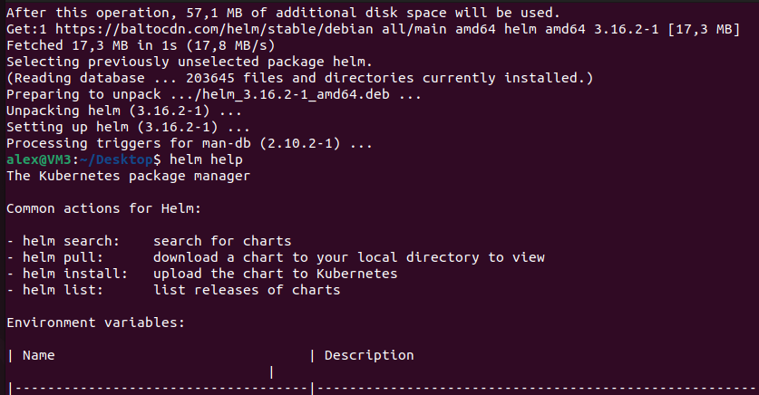

### Устанавливаем Prometheus

Для начала создадим namespace, в котором будет расположен мониторинг:
```
minikube kubectl -- create namespace monitoring
```

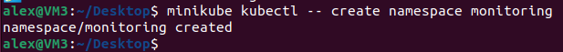

Теперь добавим репозиторий с prometheus: 
```
helm repo add prometheus-community https://prometheus-community.github.io/helm-charts
```

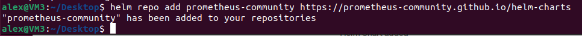

и обновим его:
```
helm repo update
```

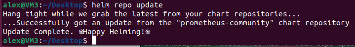

После чего устанавливаем prometheus в недавно созданное пространство:
```
helm install prometheus prometheus-community/prometheus --namespace monitoring
```

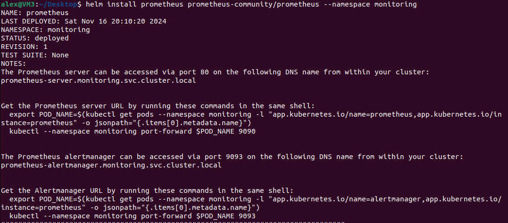
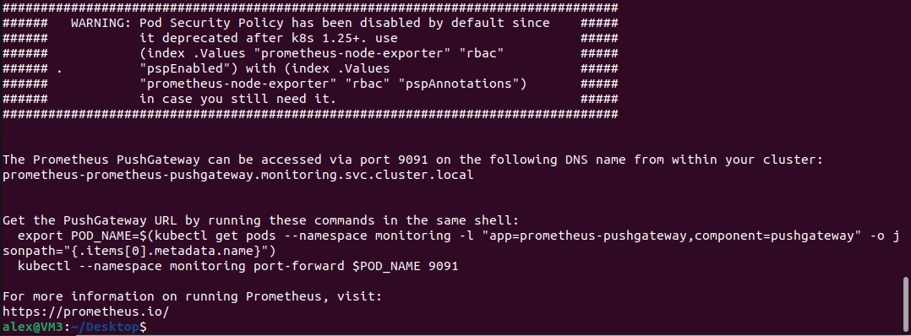

Проверяем, всё ли хорошо:
```
minikube kubectl -- get pods -n monitoring
```

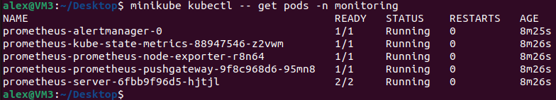


Теперь нам нужно, чтобы сервис мониторинга был доступен не только внутри кластера, но и снаружи.
Для этого делаем `expose` сервиса, и меняем его тип с ClusterIP на NodePort:
```
minikube kubectl -- expose service prometheus-server --namespace monitoring --type=NodePort --target-port=9090 --name=prometheus-server-ext
```
Проверим, что всё хорошо, выполнив команду `minikube kubectl -- get svc -n monitoring`.
Должны увидеть сервис с именем *prometheus-server-ext* и типом *NodePort*. 
Так же мы видим внешний порт, по которому он доступен (в данном случае - 30247):
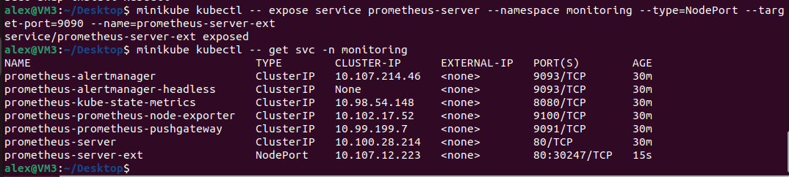

Узнаем ip миникуба с помощью команды `minikube ip`:
 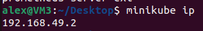

Теперь у нас есть всё необходимое, чтобы открыть вебморду prometheus в браузере: 
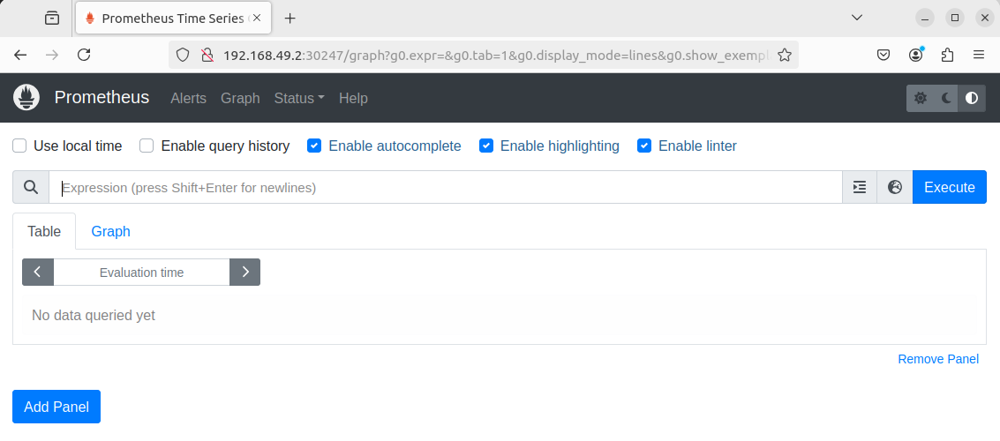

Ура, prometheus успешно установлен!

### Устанавливаем Grafana

Добавим репозиторий с grafana: 
```
helm repo add grafana https://grafana.github.io/helm-charts
```

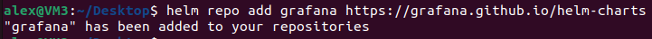

Устанавливаем grafana в пространство monitoring:
```
helm install grafana grafana/grafana --namespace monitoring
```

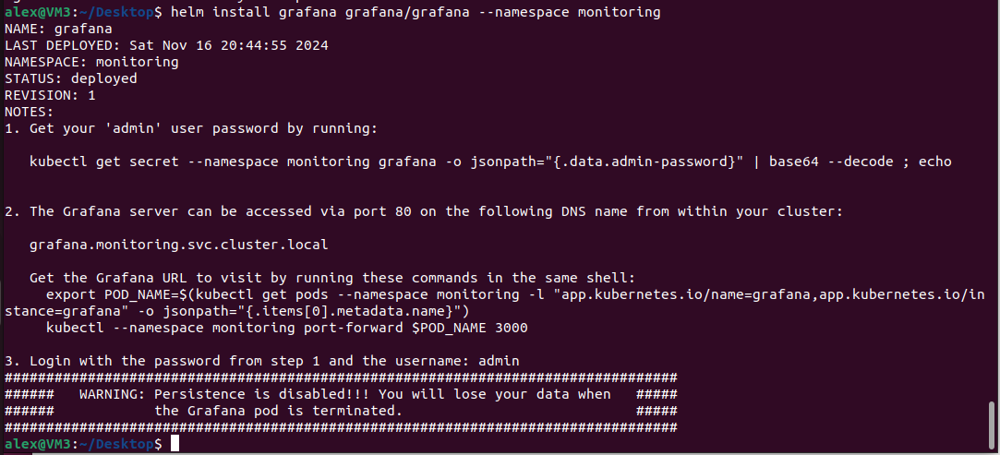

В логах видим команду для получения пароля, выполняем:

```
minikube kubectl -- get secret --namespace monitoring grafana -o jsonpath="{.data.admin-password}" | base64 --decode ; echo
```

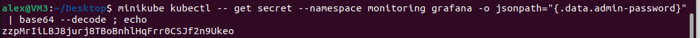

Делаем графану доступной извне по аналогии с prometheus:
```
minikube kubectl -- expose service grafana --namespace monitoring --type=NodePort --target-port=3000 --name=grafana-ext
```
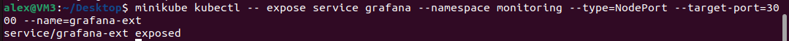

И проверяем всё той же командой: `minikube kubectl -- get svc -n monitoring`.
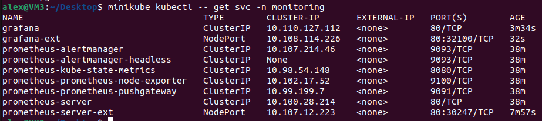

Идём в браузер и пробуем попасть в графану:
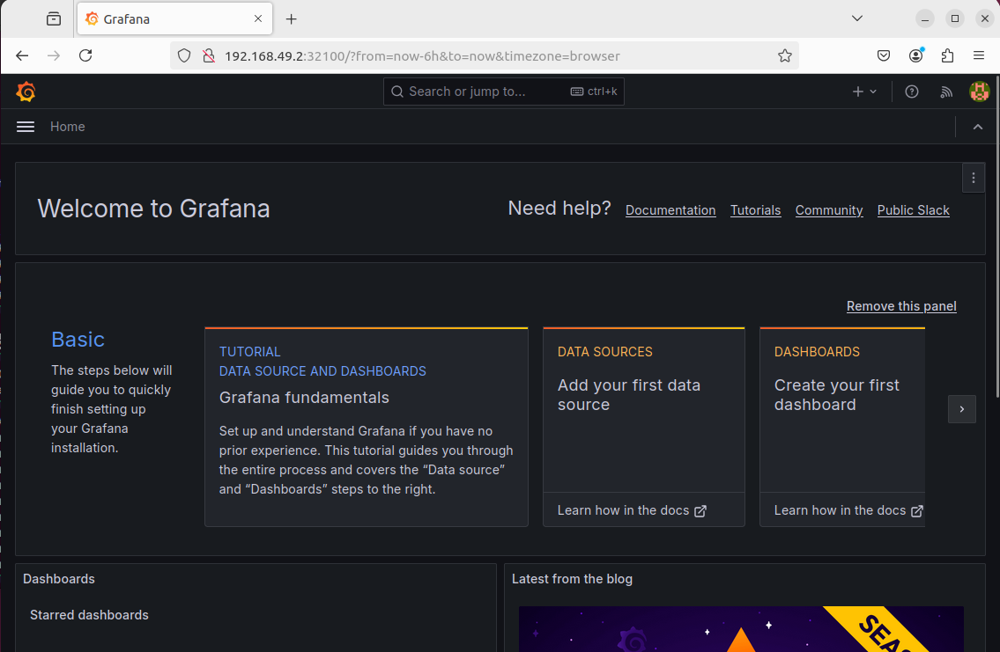

Всё хорошо, графана работает.
В качестве логина используем `admin`, а пароль мы уже узнали чуть выше.

### Добавление источника данных в Grafana

Для этого кликает по плитке `Data source`.
Там выбираем prometheus:
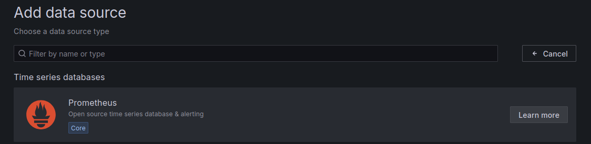

Указываем адрес сервиса prometheus:
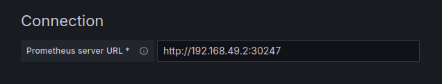

И нажимаем `Save & test`. Это сохранит настройки и проверит работу источника данных.
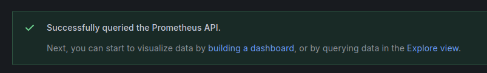

### Добавление дашборда

В меню выбираем `Dashboards` и кликаем по `Import`.
Используем уже готовый дашборд с номером 15757. Больше готовых дашбордов можно взять на сайте [графаны](https://grafana.com/grafana/dashboards/).
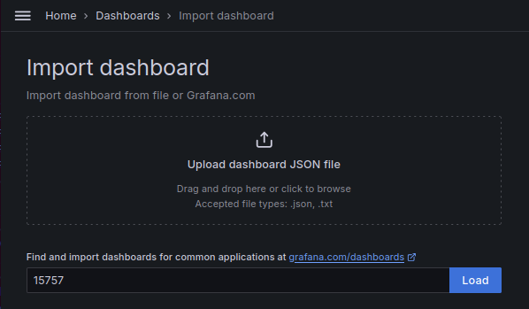

Установим prometheus в качестве источника данных для дашборда и нажмём `Import`.
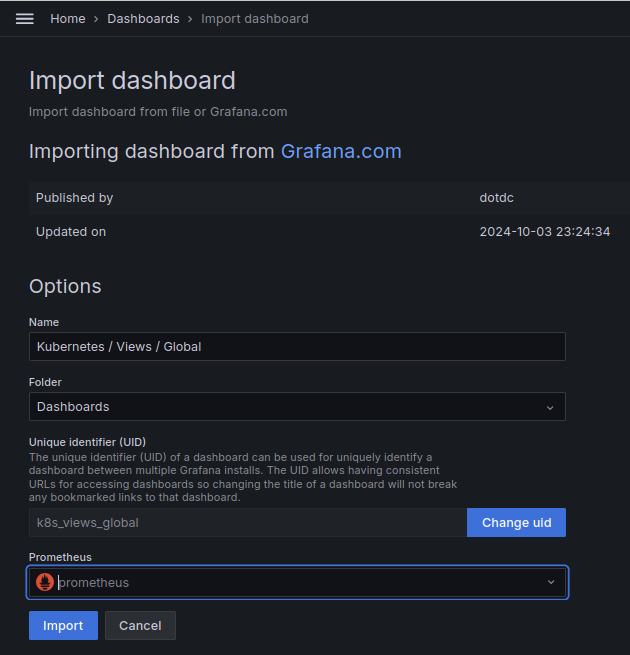

В резьтате видим наш дашборд с различными метриками кластера:
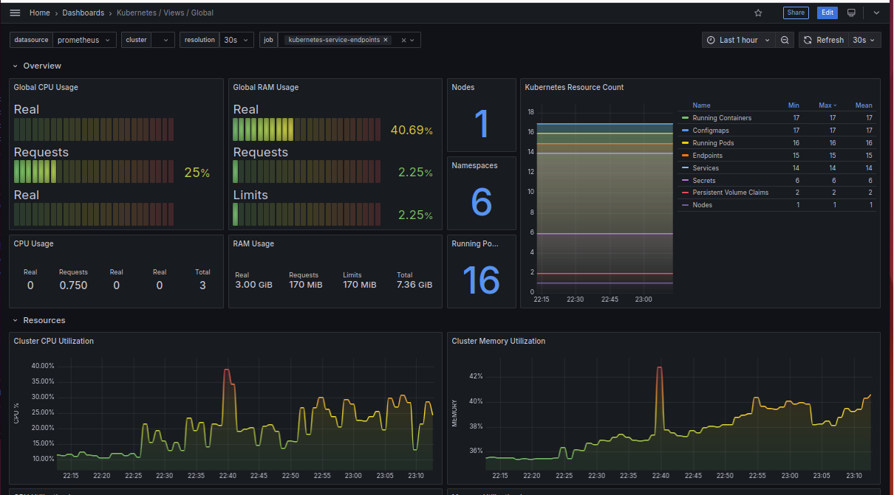


## В заключение

Мы научились собирать метрики k8s с помощью prometheus и отображать в grafana.
